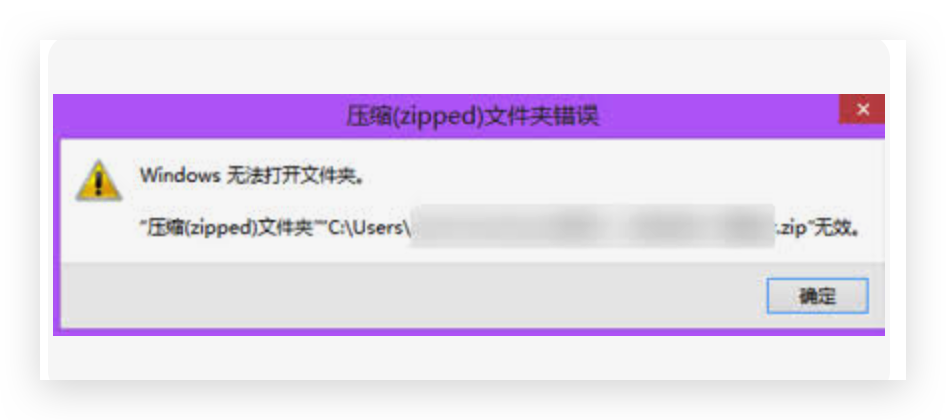

欢迎来到毕设项目安装答疑页面！

本页面主要收集整理了同学们在安装和部署毕设项目过程中遇到的常见问题和解决方案。我们会持续更新和完善这些内容,帮助大家顺利完成项目的安装部署。

如果你在安装过程中遇到了本文档未提及的问题:

1. 可以先查看项目目录下的 README.md 文件,里面有详细的安装说明
2. 如果还是无法解决,不要犹豫，直接联系微信进行咨询
3. 我们会及时收集新的问题并更新到本文档中

以下是目前收集到的一些常见问题及解决方案:

## 1. 解压环境时提示错误
我们下载好设计，再进行解压环境的时候，弹出了错误提示，提示windows无法打开文件夹，如图所示：

原因是，这是使用windows自带的解压软件进行解压的，自带的解压软件，比较鸡肋，稍微大点的文件都解压不了，从而弹出了错误提示

如果出现解压不了，可以去下载个解压软件，比如360解压软件，好压等，不过我这里推荐世界上最好的7z解压软件，下载地址    https://7-zip.org/  ，安装下，选择7z解压就行了

:::tip
我们会持续收集和更新安装过程中遇到的问题。如果你遇到了其他问题，欢迎随时反馈给我们。
:::
