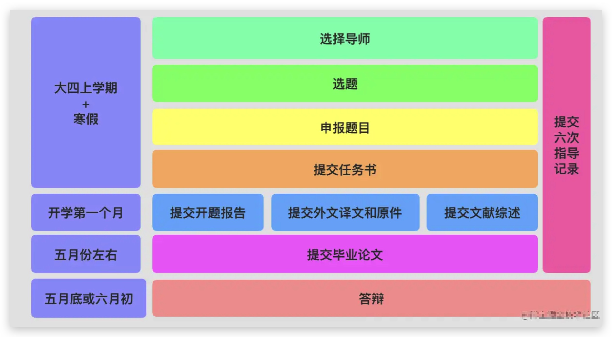

## 一、前言
::: info
 为了让各位学弟学妹对毕设流程不再彷徨迷茫，本篇内容主要是罗列了一些毕设的完成过程和注意事项，让大家在开始做毕业设计前对毕设的整个过程有一个全貌的认识。更好得对自己的时间做好规划。
:::

## 二、毕设流程
毕设的正式启动是在大四上学期快结束的时候，接着是寒假，一直持续到下学期答辩完成。

 
### 2. 1 分配毕设指导老师

分配导师一般是大四上学期快结束的时候，比如很多是12月分配的导师。

每个导师的要求不一样，有些导师要求是跟着自己的研究生一起做相关的课题；    
有些导师可能比较严格，必须做一些什么算法或者人工智能相关的课题；  
有些导师相对宽松一些，给定一些毕设题目由学生挑选，但是一般也有一些难度；    
还有一些更为宽松的老师，毕设课题完全由学生自己选择，选完之后跟老师说一下，只要不是太简单都可以。

特别强调一下，这个过程可以自己提前联系导师，也可以等学校分配指定的导师。  

大家可以根据自己的情况，比如考研考公，下学期需要去企业实习，研究生复试等，或者说下学期想尽可能多休息多玩，这种比较适合选择后两类导师，特别是第四类导师。    

:::danger
如果大家有比较了解的导师，可以**提前**联系选择，免得分配到相对严格且要求比较高的导师，这样下学期可能会比较累。
:::

### 2.2 确定毕设课题
比如包括但不限于做一个项目，研究一个算法。  

导师分配确定之后，就需要联系导师了，一般一个导师可能会带4~6个学生，需要其中某个同学主动去电话或者微信等方式联系导师，然后拉一个微信群或者QQ群，之后导师可能会有一次线下面谈，跟大家聊一下大四下学期每个学生各自的打算，然后老师会根据自己的要求让学生做自己选好的课题，或者学生自己选课题。

如果是学生自己选课题的话，选完之后需要和老师同步一下，老师会评估一下你所选课题的难易程度以及普遍程度（比如同一个老师不想自己学生中有重复课题或者极为相似课题的出现）来判断是否适合用来做毕设题目，大部分是没啥问题。

### 2.3 提交选题申报表
现在互联网这么普及和发达，应该每个高校都有自己的毕设系统，用来对学生的毕设过程进行过程管理，就是规定每个时间段必须完成毕设的某个阶段任务，提交一些阶段性的材料，比如提交开题报告，任务书等。

目的是为了防止有学生拖着不做毕设，等答辩之前来恶补，导致可能毕不了业的情况。比如下面是南X大学的毕设系统界面展示。

上面选好了题之后，需要填写一个选题申报表，申报表中填写自己的课题题目，项目的主要内容以及预期的阶段性成果。   
一般导师会发 **《选题申报表》** 模板，照着模板改成自己的就好。    
如果是导师规定题目让学生选择，在毕设系统有一个双选的过程，就是毕设老师发布题目，学生选择，然后老师确认。如果是学生自选题目的话，提交开题报告后没有双选的过程。

:::danger
**一般在大四上学期结束前**需要确定题目并提交选题申报表到系统。
:::

### 2.4 提交任务书

任务书一般是寒假的时候提交。    
任务书也有模板，把模板改成自己的内容就好。    
任务书中主要会包含项目的内容和参考文献，这里的参考文献可以大致得根据自己可能使用的技术和选题背景挑选一些论文作为文献，虽然很早就需要提交到毕设系统中，但是这个系统只是用来做为过程管理，最终还是以任务书的纸质稿为准，所以如果任务书中有功能没有实现，有参考文献没有引用或者加入了新的参考文献，不必重新提交到系统，只需修改电子版，到最后交的时候打印出来即可。

任务书是最后和答辩文档一起打印出来交给导师，

### 2.5 提交开题报告
:::danger
开题报告一般是大四下学期开始后的一个月内会要求提交
:::

开题报告中包含选题背景，国内外研究现状，创新点，研究意义，预期的结果和进度安排等，基本上等于论文的绪论部分了，所以如果在这之前已经完成了毕设论文的绪论部分的话基本上可以直接复制过来了。

### 2.6 提交外文译文和原件

选一篇自己引用的英文参考文献或者没引用但是与自己课题内容相关的英文文献，翻译前2000个字，或者3000个字，如果不觉得麻烦的话，翻译全文也行，但是翻译的文字个数需要大于2000或者3000， 每个专业的字数限制不太一样。 

这里老师可能会给一个译文的模板，如果译文的各种字体或者段落格式很烂的话，可以自己调整，调整成毕业论文的格式就行。译文的格式要求不高。

### 2.7 提交文献综述（或者说是引用）
这个部分主要是概述一下自己对所引用的参考文献的理解，包括
::: warning    
① 理论的渊源及演进过程    
② 国外有关研究的综述    
③ 国内研究的综述    
④ 本人对以上综述的评价
:::

可以直接将国内外研究现状复制在这里。    
因为毕设系统只是用来过程管理的，对这个文献综述的要求不高，只要提交了应该就没有什么问题。

### 2.8 提交毕业论文

论文的格式要求后面会详细列出，这里想强调的是**论文尽可能早点写**，因为论文有字数要求，一般是8000字以上，40页以上，这里是计算机系的要求，每个学校和专业可能要求不一样，可以作为参考。    

如果留给自己写论文的时间不多，比较仓促的话，写的过程会比较痛苦。    

:::danger
论文提交到系统后，如果老师审批通过了，会自动查重，无需到第三方平台进行查重，特别是一些宣称查重免费或者便宜的小网站，很可能会把你的论文记录下来然后拿去售卖，切不可为了这种小利耽误自己的毕业大事。    
:::

每个学校应该都有几次免费的查重机会，也就是可以提交论文到毕设系统，老师审批过后触发查重，即可开始查重，这个过程只能往复三次。    
只要不是大片抄袭，一般查重都能过的，三次查重机会一般都够用。

### 2.9 贯穿整个毕设过程的一个操作：提交指导记录

一般是每两周提交一次指导记录，一般每次写几句话就行，大概写这两个礼拜干了啥，导师安排的任务等。

## 三、论文内容

每个专业可能不太一样，这里以某个大学计算机科学与技术专业的模板为例

 - 摘要
 - 绪论（包含研究背景、国内外研究现状、本课题的研究意义和创新点， 研究意义可以从理论意义和现实意义两个角度出发）
 - 需求分析
 - 总体设计
 - 详细设计与编码实现
 - 测试
 - 总结和展望
 - 参考文献
 - 致谢

## 四、论文格式
这个每个学校可能不太一样，甚至同个学校每个学院和专业也有所区别，但是大体上都是下面这些。    
下面以大学计算机科学与技术专业的本科论文格式要求为例。
 
### 4.1 页面设置 

上2.54cm,下2.54cm,左3.67cm,右2.67cm,页眉1.5cm,页脚1.75cm，行间距1.35倍。因为需要打印出来，所以页面选择对称页边距。

### 4.2 目录

“目录”两字小三号宋体加粗，目录内容小四号宋体，页码数字对齐。

### 4.3 页眉和页码

页眉和页码从中文摘要开始，页眉为相应内容的标题，页码从中文摘要、Abstract、目录用罗马数字(I，II，III……)编排，从正文第一章开始按照阿拉伯数字（1，2，3……）编排。

### 4.4 摘要

#### 4.4.1．中文摘要

标题小二号宋体加粗，“专业、学号、姓名、指导教师”五号宋体，“摘要”两字四号宋体，摘要内容小四号宋体，“关键词”三字小四号宋体加粗，

#### 4.4.2．英文摘要

标题小二号Times New Roman 体加粗，“Abstract” 四号Times New Roman 体；“Abstract” 内容小四号Times New Roman 体，“Keyword”小四号Times New Roman 体加粗。
五

### 4.5 正文

标题四号宋体，正文内容小四号宋体。

### 4.6 图表

图表内容五号宋体。

如果是图片：图标题置于图的下方，中文宋体，英文Times New Roman ，五号加粗居中，图序与图名文字之间空一个汉字符宽度；内容：中文宋体，英文Times New Roman，五号，行距1.35。

如果是表格：表标题置于表的上方，中文宋体，英文Times New Roman ，五号加粗居中，表序与表名文字之间空一个汉字符宽度；内容：中文宋体，英文Times New Roman，五号，行距1.35。

### 4.7 参考文献

“参考文献”四字四号宋体，参考文献内容小四号宋体，其中英文用小四号Times New Roman 体。

### 4.8 致谢

“致谢”两字四号宋体，致谢内容小四号宋体。

### 4.9 论文的每个章节

（封面、原创性声明、目录、中文摘要、英文摘要、每个大章节、参考文献、致谢）的首页都必须保证在奇数页，也就是打印出来保证在正面，可以采用插入空白页的方式来调控。

这里需要着重指出的是论文除了封面，其他所有页面的字体统一是：中文为宋体，英文和数字为Times New Roman 体，也包括目录、页眉页脚和代码。

## 五、注意事项

::: warning
1. 答辩形式是每20、30人为一个答辩组，每个答辩组由4～6个老师负责答辩，所有人答辩在一天内完成    
2. 答辩一般是不同老师之间交叉答辩，也就是同一个老师负责答辩其他老师指导的学生，所以说答辩的同学面对的答辩组老师一般不会有自己导师    
3. 答辩可能是以讲PPT的形式进行，答辩开始前给每位答辩老师发一份毕设论文纸质稿   
4. 毕设评分 = 导师打的分 * 0.3 + 评阅专家老师给的平均分 * 0.3 + 答辩组老师给的平均分 * 0.4， （答辩老师给分很看项目的工作量，主要体现就是论文的页数或者说字数）    
5. word排版要美观，表格不要跨页等、不要有错别字等、注意态度端正    
6. 每一页的页眉应该是本章节的大标题、页脚    
7. 引用一定达到一定的数量，每次引用不能超过200字，具体要求可以参考网上的论文书写格式   
8. 论文的第一章、第二章还有总结一定要自己写，抄网上的查重率一般很高    
9. 三次免费的知网论文查重机会，要求最终的查重率不超过30%，论文会查重，**源代码不查重**，但是需要提交留底   
10. 多画工程图，比如时序图、流程图、状态图、数据流图等。少贴代码，功能界面展示图不需要太多，每个功能一张即可。   
11. **5月初会有一次论文抽查盲审**，要求这个时间点之前论文必须已经全部完成，否则被抽到会很尴尬    
12. 任务书中的功能尽量和实际毕设中实现的功能一样，不确定能否实现的功能可以先不写在任务书里   
13. **返校即是3月初，时间很紧，抓紧时间**   
:::

## 六、好用的工具
### 6.1、翻译工具

- [https://www.deepl.com/translator](https://www.deepl.com/translator)， 翻译效果比百度和谷歌翻译好
- 外文论文下载网站：[https://scholar.dosf.top/](https://scholar.dosf.top/) （谷歌学术镜像）
- 工信部可以查询软件行业的发展情况：[https://www.miit.gov.cn/gxsj/tjfx/](https://www.miit.gov.cn/gxsj/tjfx/)
- 找文献引用可以去知网搜同名的文档

### 6.2、降低论文查重率

- 使用文库的：[https://wenku.baidu.com/](https://wenku.baidu.com/)
- 多使用近邻词替换，紧邻词检索工具：[https://tool.mingdawoo.com/](https://tool.mingdawoo.com/)

### 6.3、需求分析时的用例图绘制规则和方法

- 用例图可以按角色划分，也可以按模块划分：[https://www.cnblogs.com/spring5/archive/2011/10/15/2485293.html](https://www.cnblogs.com/spring5/archive/2011/10/15/2485293.html)
- 用例图的使用，用例图主要用来描述需求的：[UML建模——用例图（Use Case Diagram](https://www.cnblogs.com/lcword/p/10472040.html)

### 6.4、关系型数据库设计流程
[关系型数据库设计流程（全网最全---没有之一）](https://blog.csdn.net/biggerchong/article/details/85221468)

## 七、问答

### 7.1 论文先写摘要还是正文
　　摘要和正文都是论文的关键部分，摘要是文章核心内容的提炼，正文自然就是文章的核心内容了，先写作哪一个主要看作者的写作习惯，有作者习惯先写正文的，也有习惯先写作摘要的。    
　　按照学术论文的写作要点来说，先写作正文后写作摘要比较合理， 我们前面说到摘要是文章核心内容的提炼，先写作完毕正文部分其实有利于摘要的写作的，这时文章的核心内容已经非常显而易见了，很容易提炼，如果先写作摘要，文章正文本身还没有写作出来，除非作者对文章的内容已经熟记于心，先写作摘要也未尝不可。   
　　合格的摘要包括研究目的、实验方法、结果和最终结论等关键内容，摘要的字数一般在200-400字左右，合格的摘要可以让读者无需阅读全文就可以把握文章的核心内容，所以，摘要写作放在正文写作之后更合适一些。   
　　所以先写摘要还是先写正文一是看作者的写作习惯。另一个是看学科的具体情况，有时不同学科适合不同的写作顺序，以上就是对论文写作先写摘要还是先写正文的提示。    

  参考：[论文先写摘要还是正文](https://www.zhichengyz.com/news/11/43761.html)

### 7.2 论文工作总结和摘要有什么区别？
从工科论文的角度简单说一下。    
摘要，用来说当前这篇文章“要”干啥(背景/动机/问题/创新点/其它)    
结论，用来说当前文章“已经”做了什么、取得哪些效果、验证了哪些东西、还可以向哪个方向推广，诸如此类。也可以说是推销自己的产品。    
两者可以有些内容上的重合。

泛读论文时，有些人第一遍只看题目、摘要、结论这三个部分，一个比较简单的区分就是：结论可以作为摘要的延续，摘要作为结论的铺垫，二者相辅相成，用最少的文字，讲述一个尽量完整的故事。    

参考：[论文工作总结和摘要有什么区别？](https://www.zhihu.com/question/354029240/answer/882136256)

### 7.3 书写摘要的根本标准和原则（一）
（1）论文摘要分为中文摘要和外文（一般为英文）摘要。摘要在篇幅方面的限制，不同的校园和组织有不同的要求，一般中文摘要不超越300字，英文摘要不超越250个实词，中英文摘要应共同。毕业论文摘要可适当增加篇幅。   
（2）多向辅导教师请教，并根据供给的定见及时修正，以期到达更高水平。   
（3）摘要是完好的短文，具有独立性，能够独自运用。即便不看论文全文的内容，依然能够了解论文的首要内容、作者的新观念和主意、课题所要完结的意图、采取的办法、研讨的效果与定论。   
（4）叙说完好，杰出逻辑性，短文结构要合理。   
（5）要求文字短小精悍，不容赘言，提取重要内容，不含前语、背景等细节部分，去掉旧定论、原始数据，不加谈论和注释。选用直接表述的办法，删去不必要的文学润饰。摘要中不该包含作者将来的方案以及与此课题无关的内容，做到用最少的文字供给最大的信息量。（6）摘要中不运用特别字符，也不运用图表和化学结构式，以及由特别字符组成的数学表达式，不罗列例子。    
3.摘要的四要素意图、办法、效果和定论称为摘要的四要素。    
（1）意图：指出研讨的规模、意图、重要性、使命和前提条件，不是主题的简略重复。   
（2）办法：简述课题的作业流程，研讨了哪些首要内容，在这个过程中都做了哪些作业，包含目标、原理、条件、程序、手法等。   
（3）效果：陈说研讨之后重要的新发现、新效果及价值，包含经过调研、实验、调查获得的数据和效果，并分析其不理想的限制部分。   
（4）定论：经过对这个课题的研讨所得出的重要定论，包含从中获得证实的正确观念，进行分析研讨，比较猜测其在实际生活中运用的意义，理论与实际相结合的价值。   

参考： [摘要的标准原则](https://www.zhihu.com/question/30536680/answer/419960370)

### 7.4 书写摘要的根本标准和原则（二）
论文摘要是文章的内容不加诠释和评论的简短陈述。为了国际交流，还应有外文(多用英文)摘要。    
摘要是在文章全文完成之后提炼出来的，具有短、精、完整三大特点。    
摘要应具有独立性的自含性、即不阅读原文的全文．就能获得必要的信息。    
摘要中有数据、有结论、是一篇完整的短文．可以独立使用，也可以引用，还可以用于工艺推广。    
其内容应该包含与报告论文同等量的主要信息．以供读者确定有无必要阅读原论文全文，也可提供给文摘第二次文献采用。
  
摘要一般应说明研究工作目的、实验方法、结果和最终结论等．而重点是结果和结论。    
  **中文摘要一般不宜超过300字，外文摘要不宜超过250个实词。**    

除了实在迫不得已，摘要中不用图、表、化学结构式、非公知公用的符号和术语。摘要可用另页置于题名页(页上无正文)之前，学术论文的摘要一般置于题名和作者之后，论文正文之前。    
论文摘要又称概要、内容提要。    

摘要是以提供文献内容梗概为目的，不加评论和补充解释，简明、确切地记述文献重要内容的短文。    
其基本要素包括研究目的、方法、结果和结论。具体地讲就是研究工作的主要对象和范围，采用的手段和方法，得出的结果和重要的结论，有时也包括具有情报价值的其它重要的信息。摘要应具有独立性和自明性，并且拥有与文献同等量的主要信息，即不阅读全文，就能获得必要的信息。摘要不容赘言,故需逐字推敲。内容必须完整、具体、使人一目了然。英文摘要虽以中文摘要为基础,但要考虑到不能阅读中文的读者的需求,实质性的内容不能遗漏。为此,我国的科技期刊近年来陆续采用结构式摘要,明确写出目的、方法、结果和结论四部分。

　　a.目的(Objective):简明指出此项工作的目的,研究的范围。   
　　b.方法(Methods):简要说明研究课题的基本做法,包括对象(分组及每组例数、对照例数或动物只数等)、材料和方法(包括所用药品剂量,重复次数等)。统计方法特殊者需注明。    
　　c.结果(Results):简要列出主要结果(需注明单位)、数据、统计学意义(P值)等,并说明其价值和局限性。    
　　d.结论(Conclusion):简要说明从该项研究结果取得的正确观点、理论意义或实用价值、推广前景。   
　　中、英文摘要前需标明中、英文文题，作者姓名(至多3名)及作者单位(邮政编码)。英文摘要应隔行打字,以便修改。    
　　
- 摘要的写作注意事项    
　　1)摘要中应排除本学科领域已成为常识的内容；切忌把应在引言中出现的内容写入摘要；一般也不要对论文内容作诠释和评论(尤其是自我评价)。      
　　2)不得简单重复题名中已有的信息。比如一篇文章的题名是《几种中国兰种子试管培养根状茎发生的研究》，摘要的开头就不要再写：“为了……，对几种中国兰种子试管培养根状茎的发生进行了研究”。    
　　3)结构严谨，表达简明，语义确切。摘要先写什么，后写什么，要按逻辑顺序来安排。句子之间要上下连贯，互相呼应。摘要慎用长句，句型应力求简单。每句话要表意明白，无空泛、笼统、含混之词，但摘要毕竟是一篇完整的短文，电报式的写法亦不足取。摘要不分段。    
　　4)用第三人称。建议采用“对……进行了研究”、“报告了……现状”、“进行了……调查”等记述方法标明一次文献的性质和文献主题，不必使用“本文”、“作者”等作为主语。    
　　5)要使用规范化的名词术语，不用非公知公用的符号和术语。新术语或尚无合适汉文术语的，可用原文或译出后加括号注明原文。    
　　6)除了实在无法变通以外，一般不用数学公式和化学结构式，不出现插图、表格。    
　　7)不用引文，除非该文献证实或否定了他人已出版的著作。    
　　8)缩略语、略称、代号，除了相邻专业的读者也能清楚理解的以外，在首次出现时必须加以说明。科技论文写作时应注意的其他事项，如采用法定计量单位、正确使用语言文字和标点符号等，也同样适用于摘要的编写。目前摘要编写中的主要问题有：要素不全，或缺目的，或缺方法；出现引文，无独立性与自明性；繁简失当。    

参考： [摘要写作注意事项](https://zhidao.baidu.com/question/563771466.html)

### 7.5 本科论文参考文献注意事项

1. 中文文献10篇以上   
2. 外文文献2篇以上（指导教师认定为特殊类型的论文，可以不列外文参考文献）  
3. 参考文献必须是公开出版、发表的（含网上下载）着作或期刊（论文），统一放在文后，并按文中出现的先后顺序，用阿拉伯数字进行自然编号，序码加方括号

### 7.6 论文常用词汇
1. “说明”说明是用简明扼要的语言，把事物的实际情况，恰如其分地表述出来。
2. “简述”用简要的语言陈述，描述或总结。简单陈述。虽说是“简”，但还是要羊细的。写的太深就没有必要了。
3. “分析”将事物、现象、概念分门别类,离析出本质及其内在联系。
4. “概述”大略地叙述的意思，是对文章或事物的一种概括表达。
5. “阐述”详尽深入地说明和陈述。
6. “概括”归纳,总结。把事物的共同特点归结在一起加以简明地叙述。

### 7.7 查重范围
1. 文献相似度=送检论文中与检测范围所有文献的相似字数/送检论文正文字符数 
2. 去除参考文献相似度=送检论文中检测范围所有文献(不包括参考文献)的相似字数/送检论文正文字符数
3. 去除本人已发表论文相似度=送检论文中与检测范围所有文献(不包括自引)的相似字数/送检论文正文字符数
4. 单篇最大相似度:送检论文与某一文献的相似度高于全部其他文献 
5. 正文字符数:送检论文正文部分的总字符数，包括汉字、非中文字符、标点符号、阿拉伯数字(不计入空格) 
6. 正文字数:送检论文正文部分的总字数，正文不包括摘要、关键词、目录、图片、附录、参考文献等

## 八、 总结
:::info
1. 如果你看到了这里，回头再通读几遍，那么毕设的整体流程你应该已经烂熟于心
2. 这个网站包含大多数项目都是最新的企业级实战项目，可以保证每个项目都在电脑上运行成功，且保证代码答疑
3. 此毕设项目源码下载，可添加[我的微信](https://img.liugezhou.online/common/wx_ztz.jpg)，为你发送项目设计源码
:::